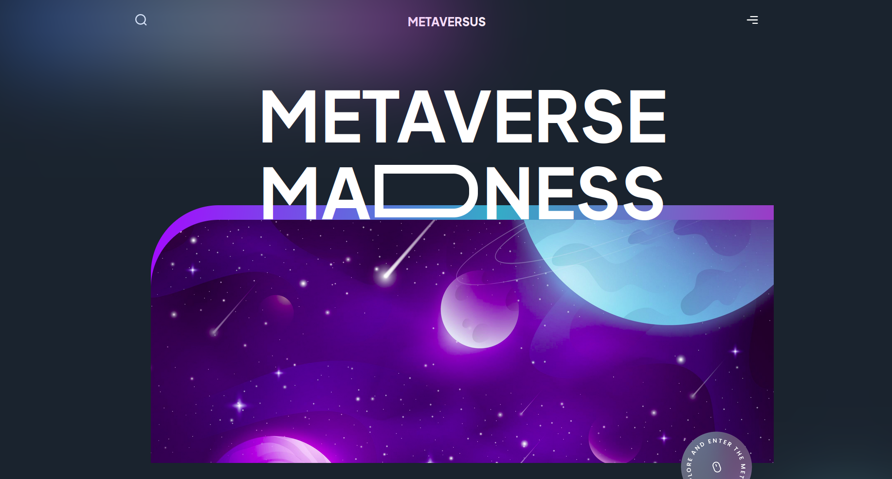

# Metaverse

A guided project builting an interactive Next.js website showing the use case for the metaverse

## Screenshots:


Motivation:

improve my front end development skills and work with motion 

## Built with:
Vite,
Thirdweb,
Solidity,
Ethers

## How to use:

```
npm run dev
# or
yarn dev
```

## Contribute:

Feel free to a fork the repo or notify me of any issues that are present

Credit: 

JavascriptMastery tutorial - https://www.youtube.com/watch?v=ugCN_gynFYw&t=13s

## License:

MIT © BChainDev 

